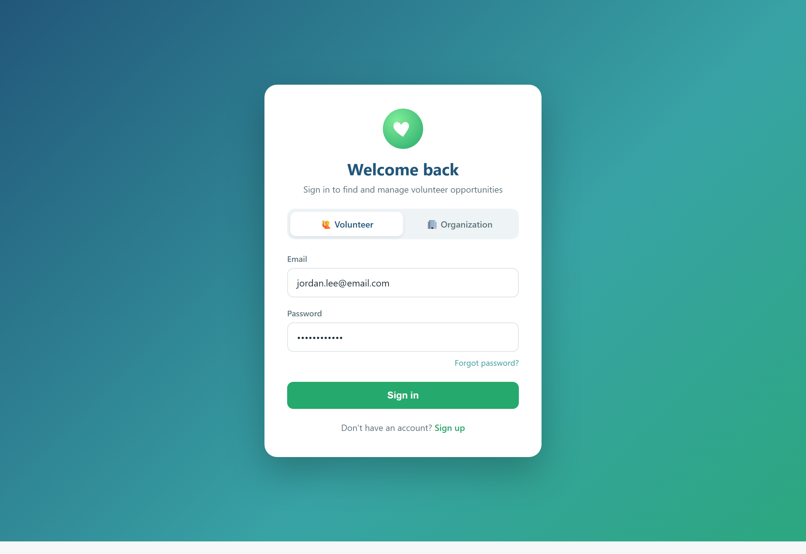
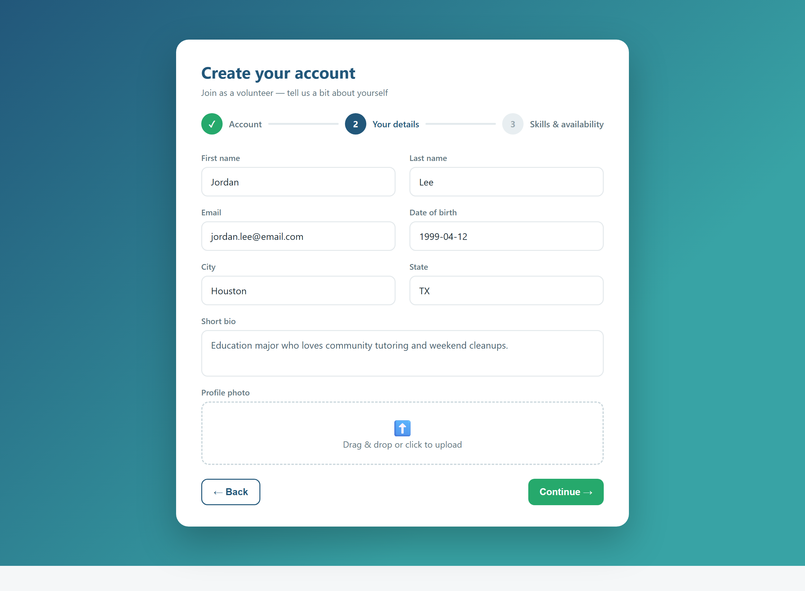
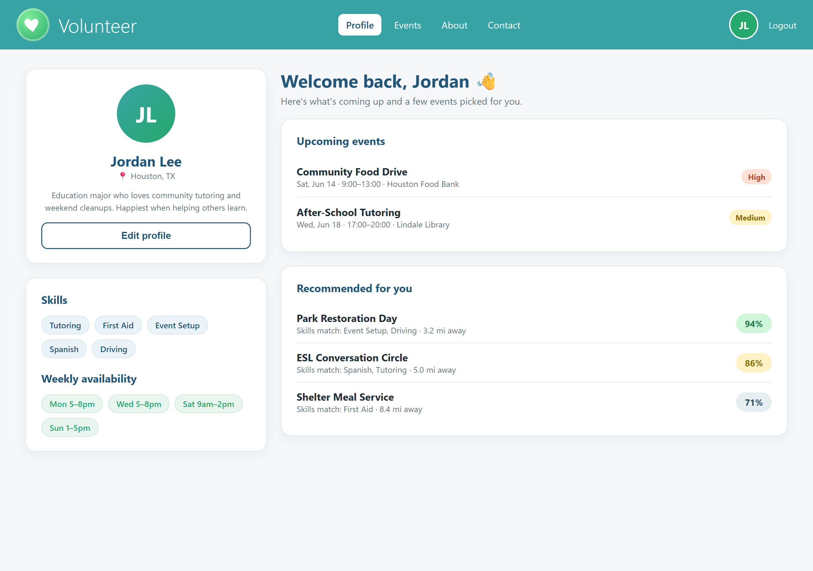
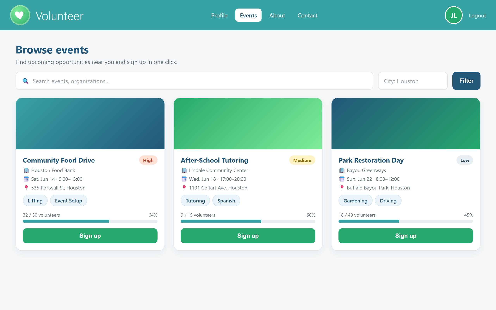
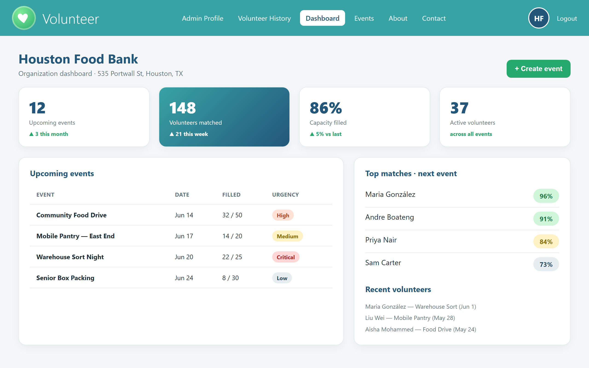
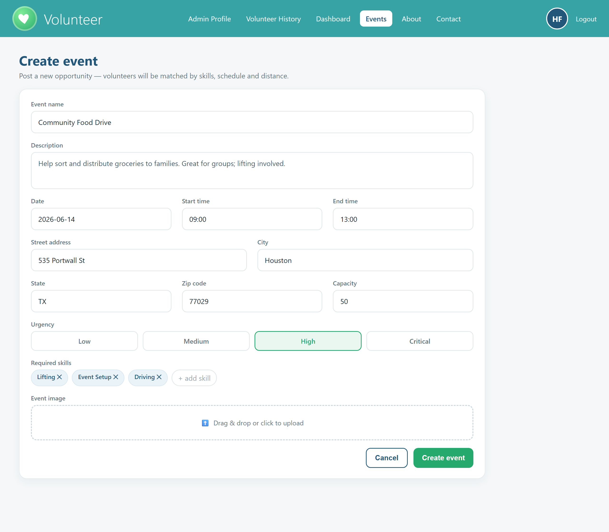
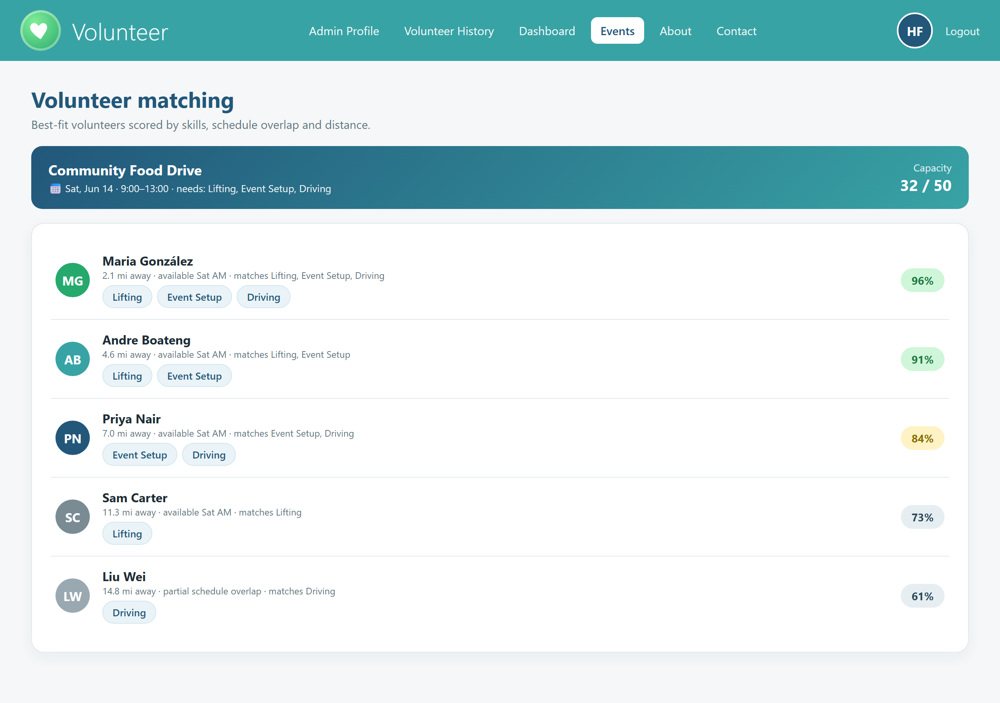
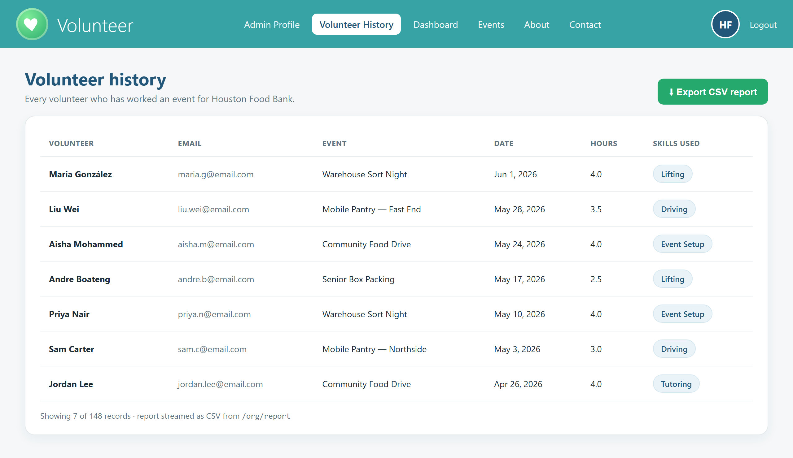

# Volunteer Website

A full-stack platform that matches volunteers with the organizations and events that need them.
Volunteers build a profile (skills, weekly availability, location); organizations post events; and a
location-, skill-, and schedule-aware matching engine recommends the best people for each event — and the
best events for each volunteer.

This repository is the **frontend** (React + TypeScript + Vite). It talks to a separate **FastAPI backend**
([volunteer-website-backend](https://github.com/amarebanks/volunteer-website-backend)) that handles
authentication, data, image storage, geocoding, and the matching algorithm.

**Contents:** [Overview](#overview) · [Tech stack](#tech-stack) · [Features](#features) · [Demo](#demo) · [Roles and permissions](#roles-and-permissions) · [Getting started](#getting-started) · [Environment variables](#environment-variables) · [How matching works](#how-matching-works) · [API reference](#api-reference) · [Data model](#data-model) · [Architecture](#architecture) · [Project structure](#project-structure) · [Deployment](#deployment)

## Overview

The product has two kinds of users, and the entire experience — navigation, dashboards, and what the API
will allow — branches on which one you are:

- **Volunteers** create a profile, browse events, sign up or drop out, and receive personalized event recommendations.
- **Organization admins** create and manage an organization, post events, run volunteer matching, and pull reports on past volunteer activity.

## Tech stack

### Frontend (this repository)

| Tool | Purpose |
| --- | --- |
| React 19 + TypeScript | UI library and type safety |
| Vite 7 | Dev server and build tool |
| React Router 7 | Client-side routing |
| Tailwind CSS 4 | Styling |
| Framer Motion | Animations and transitions |
| Zod | Runtime form and schema validation |
| React Icons | Iconography |
| Firebase Hosting | Static deploy target |

### Backend ([separate repository](https://github.com/amarebanks/volunteer-website-backend))

| Tool | Purpose |
| --- | --- |
| FastAPI + Uvicorn | REST API |
| SQLAlchemy 2 + Alembic | ORM and migrations |
| PostgreSQL + PostGIS / GeoAlchemy2 | Relational database with geospatial (distance) queries |
| PyJWT + bcrypt | JWT auth and password hashing |
| AWS S3 (boto3) | Profile and event image uploads |
| Google Geocoding API | Address to latitude/longitude |
| Heroku | API hosting |

## Features

**Shared**

- JWT authentication with role-aware sign-in (volunteer vs. admin) and bcrypt-hashed passwords.
- Image uploads for profiles, organizations, and events (stored in S3).
- Address geocoding, so distance can be factored into matching.
- In-app notifications for both roles.

**Volunteer**

- Build a profile with skills, weekly availability, location, photo, and bio.
- Browse all upcoming events and view event details.
- Sign up for or drop out of events.
- Personalized recommendations: top events scored by skill, schedule, and distance.
- A history of past events.

**Organization admin**

- Register a new organization or join an existing one (with org search).
- Create, edit, and delete events (name, description, capacity, urgency, required skills, date/time, location, image).
- Volunteer matching: top-scored volunteers for any event, or the best matches across every upcoming event.
- An organization dashboard with summary stats, upcoming events, and recent volunteers.
- CSV report export of the organization's full volunteer history.

## Demo

> The images below are design mockups that illustrate the intended UI and the brand palette. Replace them
> with live screenshots at any time by overwriting the matching files in [docs/screenshots/](docs/screenshots);
> the HTML used to generate them lives in `docs/screenshots/_mockups/`.

### Sign in and sign up

| Sign in | Sign up |
| --- | --- |
|  |  |

### Volunteer experience

| Profile and recommendations | Browse and join events |
| --- | --- |
|  |  |

### Admin experience

| Dashboard | Create event |
| --- | --- |
|  |  |

| Volunteer matching | Volunteer history and report |
| --- | --- |
|  |  |

## Roles and permissions

Every protected endpoint inspects the `userType` stored in the JWT. The token is signed at login
(`sign_JWT_volunteer` / `sign_JWT_admin`) and decoded on every request, so a volunteer token can never
perform an admin-only action and vice versa.

| Capability | Volunteer | Admin |
| --- | :---: | :---: |
| Sign up / log in | Yes | Yes |
| View own profile | Yes | Yes |
| Browse and view events | Yes | Yes |
| Sign up for / drop out of an event | Yes | No |
| Get recommended events | Yes (self) | Yes (any volunteer) |
| Create an organization / join one | No | Yes |
| Create, edit, delete events | No | Yes |
| Match volunteers to an event | No | Yes |
| View org dashboard and past volunteers | No | Yes |
| Export volunteer-history CSV report | No | Yes |

On the frontend, [Layout.tsx](src/components/Layout.tsx) renders a different navigation bar per role, and
[UserContext.tsx](src/hooks/UserContext.tsx) routes you to `/volunteer-profile` or `/OrgDashboard` after
login based on `user.role`. On the backend, the `is_admin()` / `is_volunteer()` helpers guard each route and
raise an authorization error when the role does not match — defense in depth, since the UI alone is never
trusted.

## Getting started

### Prerequisites

- Node.js 18+ (tested on Node 24) and npm
- Python 3.11 (see the backend's `runtime.txt`) for the API
- A PostgreSQL instance with PostGIS (or a Supabase project) for the backend
- Optional: an AWS S3 bucket and a Google Geocoding API key for image uploads and address lookup

### Frontend (this repository)

```bash
npm install

# create your env file and point it at the backend
cp .env.example .env.development
#   set VITE_API_BASE_URL, e.g. http://localhost:3000

npm run dev        # http://localhost:5173
```

Other scripts:

```bash
npm run build      # type-check + production build into dist/
npm run preview    # preview the production build locally
npm run lint       # run ESLint
```

If `VITE_API_BASE_URL` is unset, the app falls back to the deployed Heroku backend
(see [src/config/api.ts](src/config/api.ts)).

### Backend ([volunteer-website-backend](https://github.com/amarebanks/volunteer-website-backend))

```bash
python -m venv .venv
source .venv/bin/activate          # Windows: .venv\Scripts\activate
pip install -r requirements.txt

cp .example.env .env               # then fill in the values below

uvicorn src.main:app --reload      # http://localhost:8000, docs at /docs
```

The frontend's `.env.example` suggests `http://localhost:3000` for the API, so run uvicorn on whichever port
you point `VITE_API_BASE_URL` at (for example `uvicorn src.main:app --reload --port 3000`).

## Environment variables

**Frontend** (`.env.development` / `.env.production`)

| Variable | Description |
| --- | --- |
| `VITE_API_BASE_URL` | Base URL of the backend API |

**Backend** (`.env`)

| Variable | Description |
| --- | --- |
| `JWT_SECRET` | Secret used to sign and verify JWTs |
| `SUPABASE_USER`, `SUPABASE_PASSWORD` | Postgres credentials |
| `SUPABASE_HOST`, `SUPABASE_PORT`, `SUPABASE_DB_NAME` | Postgres connection details |
| `AWS_ACCESS_KEY`, `AWS_SECRET_KEY` | AWS credentials for S3 uploads |
| `AWS_BUCKET_NAME`, `AWS_BUCKET_REGION` | Target S3 bucket |
| `GOOGLE_GEOCODING_API_KEY` | Google Maps Geocoding API key |

## How matching works

The matching engine ([scoring.py](https://github.com/amarebanks/volunteer-website-backend/blob/main/src/dependencies/database/scoring.py))
scores each volunteer/event pair entirely in SQL by combining three weighted components:

| Component | Default max weight | How it is scored |
| --- | :---: | --- |
| Skills | 2 | Count of the volunteer's skills that match the event's required skills, capped at the weight |
| Schedule | 4 | Full points when the volunteer's weekly availability overlaps the event's day and time window |
| Distance | 4 | Linear: full points at zero distance down to zero points at `max_distance`, using PostGIS distance |

Admins call `GET /events/{id}/match` (one event) or `GET /org/events/match` (all upcoming events), and
volunteers call `GET /vol/{id}/match` for recommended events. Scores are surfaced in the UI as percentage
chips in [Matching.tsx](src/components/Matching.tsx).

## API reference

Routers are mounted in [main.py](https://github.com/amarebanks/volunteer-website-backend/blob/main/src/main.py).
Interactive docs are available at `/docs` when the API is running.

<details>
<summary><strong>/auth</strong> — authentication</summary>

| Method | Path | Auth | Description |
| --- | --- | --- | --- |
| POST | `/auth/vol/signup` | – | Register a volunteer (multipart: JSON + optional image) |
| POST | `/auth/vol/login` | – | Volunteer login, returns JWT |
| POST | `/auth/org/signup` | – | Register an admin |
| POST | `/auth/org/login` | – | Admin login, returns JWT |
| GET | `/auth` | any | Current user (auto-detects role) |
| GET | `/auth/vol`, `/auth/admin` | role | Current volunteer / admin |

</details>

<details>
<summary><strong>/events</strong> — events</summary>

| Method | Path | Auth | Description |
| --- | --- | --- | --- |
| GET | `/events/` | – | List upcoming events (paginated) |
| GET | `/events/{id}` | – | Event detail |
| POST | `/events/create` | admin | Create an event |
| PATCH | `/events/{id}` | admin | Update an event |
| DELETE | `/events/{id}` | admin | Delete an event |
| POST | `/events/{id}/signup` | volunteer | Sign up for an event |
| DELETE | `/events/{id}/dropout` | volunteer | Drop out of an event |
| GET | `/events/{id}/match` | admin | Top volunteer matches for an event |

</details>

<details>
<summary><strong>/org</strong> — organizations</summary>

| Method | Path | Auth | Description |
| --- | --- | --- | --- |
| GET | `/org/search` | – | Search organizations |
| GET | `/org/{id}` | – | Organization detail |
| POST | `/org/create` | admin | Create an organization |
| PATCH | `/org/{id}` | admin | Update an organization |
| DELETE | `/org/{id}` | admin | Delete an organization |
| POST | `/org/{id}/signup` | admin | Join an organization |
| GET | `/org/events` | admin | Upcoming events for the admin's org |
| GET | `/org/events/match` | admin | Matches across all upcoming events |
| GET | `/org/past-volunteers` | admin | Past volunteers and hours |
| GET | `/org/report` | admin | Stream a CSV volunteer-history report |
| GET | `/org/admin/{id}` | admin | Full admin dashboard payload |

</details>

<details>
<summary><strong>/vol</strong> and <strong>/notifications</strong></summary>

| Method | Path | Auth | Description |
| --- | --- | --- | --- |
| GET | `/vol/{id}` | self/admin | Volunteer profile plus upcoming/past events |
| GET | `/vol/{id}/match` | self/admin | Recommended events for a volunteer |
| GET | `/vol/{id}/history` | – | A volunteer's past events |
| POST | `/notifications/` | any | Send a notification |
| GET | `/notifications/` | any | List my notifications |

</details>

## Data model

```
Location ──< Volunteer ──< VolunteerSkill
   │            │       └─< VolunteerAvailableTime
   │            └────────< EventVolunteer >──── Event
   ├──< Organization ──< OrgAdmin
   └──< Event ──< EventSkill
Notification ── (recipient: Volunteer | OrgAdmin)
```

- `Volunteer` and `OrgAdmin` are separate tables, each constrained to its own `user_type`.
- Events and volunteers are linked many-to-many through the `EventVolunteer` association table; an event's
  `assigned`/`capacity` columns are guarded by database check constraints.
- `Location` stores a PostGIS `Geography(POINT)` so distance scoring runs in the database.
- See [dbmodels.py](https://github.com/amarebanks/volunteer-website-backend/blob/main/src/models/dbmodels.py)
  for the full schema.

## Architecture

```
  React + Vite (this repo)                         FastAPI backend
  Firebase Hosting          ── HTTPS / JWT ──▶      Heroku
  - role-aware routing      ◀── JSON ─────────      - JWT auth (role guards)
  - UserContext auth state                          - SQLAlchemy + Alembic
  - Tailwind UI                                     - matching engine (SQL)
                                                          │
                          ┌───────────────────────────────┼───────────────────────────┐
                          ▼                               ▼                             ▼
                   PostgreSQL + PostGIS          AWS S3 (images)            Google Geocoding API
```

## Project structure

```
volunteer-website-frontend/
├── public/
├── docs/screenshots/         # demo images (and _mockups/ source HTML)
├── src/
│   ├── App.tsx               # routes (role-gated via <Layout/>)
│   ├── main.tsx              # entry point
│   ├── components/
│   │   ├── auth/             # SignIn, Signup, role-specific signup forms
│   │   ├── AdminProfile.tsx, dashboard.jsx, CreateEvent.tsx, Matching.tsx, ...
│   │   ├── VolunteerProfile.tsx, userEventSite.tsx, volunteerHistory.jsx, ...
│   │   └── Layout.tsx        # role-aware nav shell
│   ├── hooks/
│   │   ├── UserContext.tsx   # auth state + login/logout
│   │   └── form-reducer.ts
│   ├── services/             # API calls (orgService, notificationService)
│   ├── config/api.ts         # API base URL
│   └── utils/                # date helpers, etc.
├── firebase.json             # Firebase Hosting config (serves dist/)
└── vite.config.ts
```

## Deployment

- **Frontend** is deployed to Firebase Hosting. `npm run build` outputs to `dist/`, then `firebase deploy`
  (config in [firebase.json](firebase.json), with SPA rewrites to `index.html`).
- **Backend** runs on Heroku via its `Procfile` (`uvicorn src.main:app`).

The backend's CORS allow-list already includes `http://localhost:5173`, `http://localhost:3000`, and the
deployed Firebase URL.
